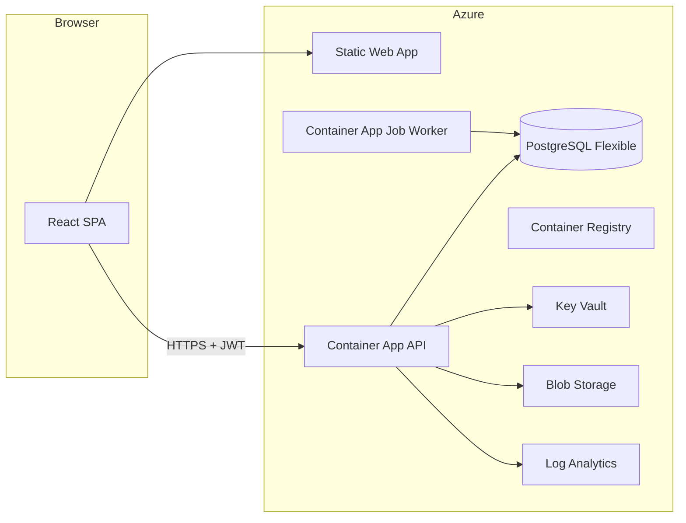

# Subscription Tracker (MVP)

Production-lean starter for a B2B SaaS that surfaces recurring software subscriptions, estimated monthly SaaS spend, and alerts for renewals, duplicate tools, and suspected unused subscriptions.

## Project overview

- **Frontend**: React + TypeScript + Vite, Redux Toolkit + RTK Query, sidebar dashboard UI.
- **Backend**: ASP.NET Core 8 Web API, Clean Architecture, EF Core + PostgreSQL, Serilog, FluentValidation, JWT bearer scaffolding for Microsoft Entra External ID.
- **Worker**: .NET worker that periodically re-runs detection and alert generation (suitable for Azure Container Apps Jobs schedules).
- **Infra**: Azure Bicep (single region, low-cost SKUs, no VNet / no private endpoints as requested).
- **CI/CD**: GitHub Actions with `azure/login` OIDC for infrastructure, API image deploy, and Static Web App publish.

## Architecture overview



**Clean Architecture dependency direction**

- `Domain` → no project references.
- `Application` → `Domain`.
- `Infrastructure` → `Application`, `Domain`.
- `Api` / `Worker` → `Application`, `Infrastructure`.

## Repository structure

```
.
├── docker/
│   ├── api.Dockerfile
│   └── worker.Dockerfile
├── docker-compose.yml
├── infra/
│   ├── main.bicep
│   └── params/
│       └── dev.bicepparam
├── src/
│   ├── backend/
│   │   ├── SubscriptionLeakDetector.sln
│   │   ├── SubscriptionLeakDetector.Domain/
│   │   ├── SubscriptionLeakDetector.Application/
│   │   ├── SubscriptionLeakDetector.Infrastructure/
│   │   ├── SubscriptionLeakDetector.Api/
│   │   └── SubscriptionLeakDetector.Worker/
│   └── web/                 # Vite + React
├── appsettings.Example.json
└── README.md
```

## Prerequisites

- [.NET SDK 8](https://dotnet.microsoft.com/download/dotnet/8.0)
- [Node.js 20+](https://nodejs.org/) and npm
- [Docker Desktop](https://www.docker.com/products/docker-desktop/) (optional, for compose)
- [Azure CLI](https://learn.microsoft.com/cli/azure/install-azure-cli) (for deployments)
- PostgreSQL 16+ (local or Docker)

## Local development setup

### 1. Database

Start PostgreSQL (example credentials match `appsettings.json`):

```bash
docker run --name st-pg -e POSTGRES_PASSWORD=postgres -e POSTGRES_DB=subscription_tracker -p 5432:5432 -d postgres:16-alpine
```

### 2. API

```bash
cd src/backend
dotnet ef database update --project SubscriptionLeakDetector.Infrastructure --startup-project SubscriptionLeakDetector.Api
dotnet run --project SubscriptionLeakDetector.Api
```

- API listens on `http://localhost:8080`.
- Swagger UI is enabled in **Development** only (`/swagger`).
- Health: `GET http://localhost:8080/health`.
- Development auth bypass: enabled in `SubscriptionLeakDetector.Api/appsettings.Development.json` (`Auth:DevelopmentBypass:Enabled`). The seeded user uses `ExternalId = dev-user`.

**Globalization:** `Globalization:DefaultCulture` (BCP 47, e.g. `en-GB`) and `Globalization:DefaultCurrency` (ISO 4217, e.g. `GBP`) are stored on the **account**, returned from `GET /api/me`, and used for `Intl` currency formatting in the web app. New dev seeds read these from `appsettings.Development.json`. CSV imports without a `Currency` column use the account default.

### 3. Web

```bash
cd src/web
npm install
npm run dev
```

Vite proxies `/api` and `/health` to `http://localhost:8080` (see `vite.config.ts`).

### 4. Worker (optional)

```bash
cd src/backend
dotnet run --project SubscriptionLeakDetector.Worker
```

### Owner confirmation workflow (MVP)

- Subscriptions can store **owner name / email** (and optional `OwnerUserId` when linked to a user in the account). Review fields (`ReviewStatus`, `NextReviewDate`, etc.) drive follow-ups.
- **Alerts** support `AlertStatus` (`Open`, `PendingConfirmation`, `Resolved`, `Dismissed`). Renewal / suspected-unused / owner workflows use **pending confirmation** until someone responds.
- **API:** `PATCH /api/subscriptions/{id}/owner`, `POST /api/subscriptions/{id}/request-review`, `POST /api/alerts/{id}/respond` (body: `{ "response": 0|1|2, "notes": "..." }` for still needed / not needed / not sure). `GET /api/subscriptions` and `GET /api/alerts` return the new fields; dashboard summary includes **pendingConfirmationCount**.
- Apply the latest EF migration after pulling: `dotnet ef database update --project SubscriptionLeakDetector.Infrastructure --startup-project SubscriptionLeakDetector.Api`.

## Manual Azure setup checklist

1. Create a **resource group** in a single region (for example `eastus`).
2. Decide a **name prefix** (letters/numbers, used by Bicep for resource names).
3. Create (or plan for) **Azure Container Registry**, **Log Analytics**, **Key Vault**, **Storage**, **PostgreSQL Flexible Server**, **Container Apps environment**, **Container App (API)**, **Container App Job (worker)**, **Static Web App** — the sample `infra/main.bicep` deploys these together.
4. Store **PostgreSQL admin password** and **storage connection strings** only in **Key Vault** or **GitHub secrets** for CI/CD — not in source control.
5. Configure **CORS** on the API to allow your Static Web App URL.
6. Assign **managed identities** (ACR pull, Key Vault secrets user) — the Bicep sample includes ACR pull role assignments for API/worker identities.

## Microsoft Entra External ID setup

This section is a **manual walkthrough** for wiring JWT bearer auth the way the API expects (`AzureAd` section).

### 1. Open the admin center

1. Go to [Microsoft Entra admin center](https://entra.microsoft.com/).
2. Sign in as an administrator of your tenant.
3. If you use **External ID for customers (CIAM)**, open **Microsoft Entra External ID** from the home experience and select your **customer directory** (tenant).

### 2. Register the SPA (frontend)

1. Navigate to **App registrations** → **New registration**.
2. Name: `Subscription Tracker Web` (example).
3. **Account types**: choose the option that matches External ID / customer users.
4. **Redirect URI**: **Single-page application (SPA)** — add:
   - `http://localhost:5173/` (Vite dev)
   - your production Static Web App URL, for example `https://<app>.azurestaticapps.net/`
5. After creation, open **Certificates & secrets** — SPAs use **public client** flows (no client secret) with MSAL.
6. Record **Application (client) ID** of the SPA — used in MSAL `auth.clientId`.

### 3. Register the API (backend)

1. **App registrations** → **New registration** — name `Subscription Tracker API`.
2. After creation, open **Expose an API**:
   - **Application ID URI**: set to something like `api://<api-client-id>` or a custom URI — this becomes the **Audience** expected by the API.
   - **Add a scope**, for example `access_as_user`, with admins and users allowed.
3. Record **Application (client) ID** for the API (used in some validation scenarios).

### 4. Grant the SPA permission to call the API

1. Open the **SPA** registration → **API permissions** → **Add a permission** → **My APIs** → pick `Subscription Tracker API`.
2. Select delegated permissions for the scope you created (for example `access_as_user`).
3. **Grant admin consent** if your directory requires it.

### 5. Redirect URIs summary

- Local: `http://localhost:5173/`
- Production SWA: `https://<your-static-app>.azurestaticapps.net/`

Add **Logout URL** equivalents if you configure front-channel logout in MSAL.

### 6. Values to copy into this repo

| Value | Where it comes from | Where to paste |
| --- | --- | --- |
| **Tenant ID** | Entra tenant / External ID directory ID | `SubscriptionLeakDetector.Api` → `AzureAd:TenantId`; authority uses `https://<tenantId>.ciamlogin.com/<tenantId>/v2.0` (see `ServiceCollectionExtensions.cs` — adjust if Microsoft changes CIAM authority format). |
| **Client ID** | Often the **SPA** client ID for MSAL | Frontend MSAL config (when you add MSAL) — **not** the same as API `Audience`. |
| **Audience** | API **Application ID URI** (from Expose an API) | `AzureAd:Audience` in API configuration. |

> **TODO markers** in code: search `TODO` under `SubscriptionLeakDetector.Api` for authority and token validation notes.

### 7. Local token testing (optional)

Point `AzureAd` at your tenant, run the SPA with MSAL to obtain an `access_token` for the API scope, and call the API with `Authorization: Bearer <token>`. Disable `Auth:DevelopmentBypass:Enabled` when testing real JWTs.

## GitHub OIDC setup

### 1. Create an Azure AD application (federated identity)

1. In Microsoft Entra, **App registrations** → **New registration** — name `github-oidc-subscription-tracker`.
2. After creation, note **Application (client) ID** → this is `AZURE_CLIENT_ID`.
3. Note **Directory (tenant) ID** → `AZURE_TENANT_ID`.
4. Note Azure **Subscription ID** → `AZURE_SUBSCRIPTION_ID`.

### 2. Grant subscription deployment rights

1. **Subscriptions** → your subscription → **Access control (IAM)**.
2. **Add role assignment** → **Contributor** (or a narrower custom role) → assign to the app registration’s managed identity / service principal.

### 3. Federated credentials for GitHub Actions

1. Open the app registration → **Certificates & secrets** → **Federated credentials** → **Add credential**.
2. **Federated credential scenario**: **GitHub Actions deploying Azure resources**.
3. **Organization**: your GitHub org or user name.
4. **Repository**: `SubscriptionsTracker` (or your fork).
5. **Entity type**: branch → `main` (or `environment` / `tag` as you prefer).
6. Save — repeat if you use multiple branches/environments.

### 4. GitHub repository secrets

In **Settings → Secrets and variables → Actions**, add:

| Secret | Value |
| --- | --- |
| `AZURE_CLIENT_ID` | App registration client ID |
| `AZURE_TENANT_ID` | Tenant ID |
| `AZURE_SUBSCRIPTION_ID` | Subscription ID |
| `AZURE_STATIC_WEB_APPS_API_TOKEN` | From Static Web App → **Manage deployment token** |

### 5. GitHub repository variables

Suggested **Variables** (example):

| Variable | Purpose |
| --- | --- |
| `AZURE_RESOURCE_GROUP` | Target resource group name |
| `AZURE_CONTAINER_APP_NAME` | (Recommended) Exact Container App name from Bicep output — avoids name guessing in `api.yml` |

## GitHub Actions workflows

- `.github/workflows/infra.yml` — deploys `infra/main.bicep` using `infra/params/dev.bicepparam`.
- `.github/workflows/api.yml` — builds `docker/api.Dockerfile`, pushes to ACR, updates the Container App image.
- `.github/workflows/web.yml` — builds `src/web` and publishes to Azure Static Web Apps.

**Note**: Update `infra/params/dev.bicepparam` image tags and secrets before first run. Tighten `api.yml` to use `vars.AZURE_CONTAINER_APP_NAME` if you do not want name guessing.

## Azure deployment steps (high level)

1. `az group create -n <rg> -l <region>`
2. Edit `infra/params/dev.bicepparam` — strong password, `apiImage` / `workerImage` pointing at your ACR after first build/push.
3. `az deployment group create -g <rg> -f infra/main.bicep -p @infra/params/dev.bicepparam`
4. Run database migrations against the Azure PostgreSQL instance (see below).
5. Configure **API environment variables** / Key Vault references for connection strings and `AzureAd` settings.
6. Configure **Static Web App** environment variable `VITE_API_BASE_URL` to the public API URL if the SPA calls the API directly (bypassing Vite proxy).

## Post deployment verification

1. `GET https://<api-host>/health` returns **Healthy**.
2. `GET https://<api-host>/api/me` with a valid bearer token returns your user and account IDs.
3. Import a CSV via `POST /api/transactions/import` and confirm subscriptions and alerts populate.
4. Open the Static Web App URL — dashboard loads without console CORS errors.

## Postgres + Key Vault (connection string)

### 1. Build a connection string

Example:

```
Host=<your-server>.postgres.database.azure.com;Database=subscriptions;Username=<admin>;Password=<password>;SSL Mode=Require;Trust Server Certificate=true
```

### 2. Store in Key Vault

1. Create a secret, for example `postgres-connection-string`.
2. Grant the API managed identity **Key Vault Secrets User** via RBAC.
3. Reference from App Service / Container App settings or use `@Microsoft.KeyVault(...)` if you move to App Service (Container Apps typically use secret refs or Key Vault integration).

### 3. Run migrations

From a developer machine with network access to the server (firewall allowed):

```bash
cd src/backend
$env:ConnectionStrings__DefaultConnection="<azure-connection-string>"
dotnet ef database update --project SubscriptionLeakDetector.Infrastructure --startup-project SubscriptionLeakDetector.Api
```

Or run a one-off migration job in CI with a private agent / approved IP.

## Running migrations

See **Postgres + Key Vault** and **Local development setup**. EF Core migrations live under `SubscriptionLeakDetector.Infrastructure/Persistence/Migrations`.

## Running worker locally

```bash
cd src/backend
dotnet run --project SubscriptionLeakDetector.Worker
```

`Worker:IntervalMinutes` controls the loop delay (`appsettings.json`).

For **Azure Container Apps Jobs**, prefer the schedule in Bicep (`cronExpression`) for periodic execution; the in-process timer still exists for local/docker-compose parity.

## Troubleshooting

| Symptom | Check |
| --- | --- |
| `401` on API | JWT not sent, wrong audience/authority, or dev bypass disabled without a token. |
| CORS errors | Add your Static Web App origin to `Cors:Origins` in API configuration. |
| EF migration fails | Connection string, firewall rules, SSL mode. |
| Docker build fails with NuGet paths | Ensure `.dockerignore` excludes `**/bin/**` and `**/obj/**` (already in repo). |
| Worker does nothing | No accounts in DB yet; import data or run dev seeder. |

## appsettings examples

See `appsettings.Example.json` at the repository root and `SubscriptionLeakDetector.Api/appsettings.json`.

## TODO checklist (pre-production)

- [ ] Replace placeholder `AzureAd:TenantId`, `ClientId`, `Audience` and validate JWT signing keys against Entra metadata.
- [ ] Disable `Auth:DevelopmentBypass` everywhere outside local dev.
- [ ] Tighten PostgreSQL firewall rules (remove `0.0.0.0`–`255.255.255.255` from Bicep when you have stable egress IPs or private connectivity).
- [ ] Store secrets in Key Vault; rotate PostgreSQL password.
- [ ] Configure Azure Blob `AzureStorage:ConnectionString` for durable CSV storage if required.
- [ ] Add MSAL to the React app and remove the login placeholder.
- [ ] Pin image tags in ACR and enable vulnerability scanning.
- [ ] Set `VITE_API_BASE_URL` for production Static Web App builds.

---

© Starter generated for fast iteration — extend detection, tenancy, and governance before production hardening.
